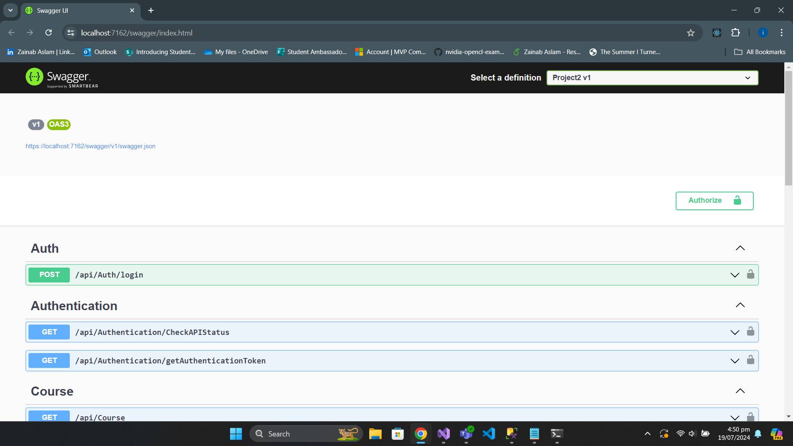
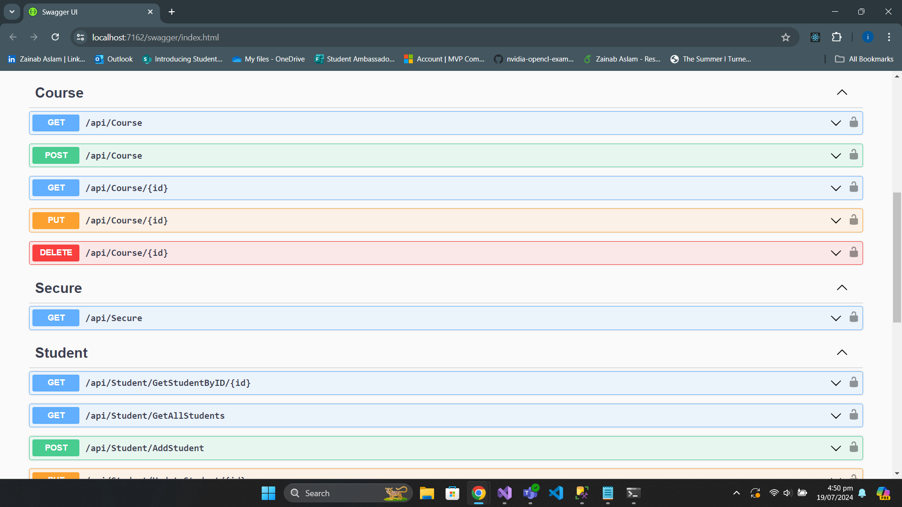
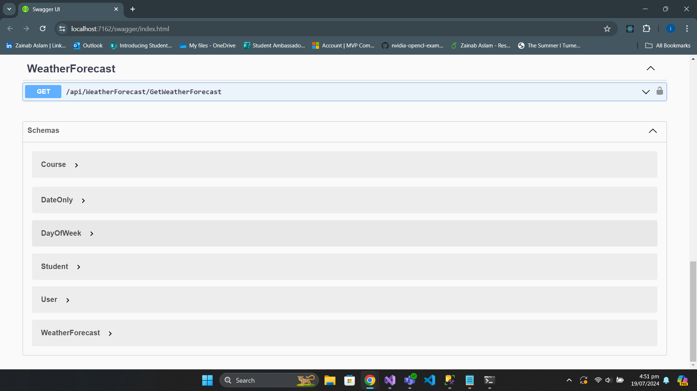
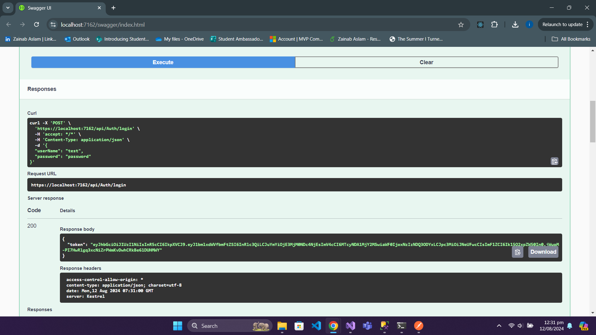
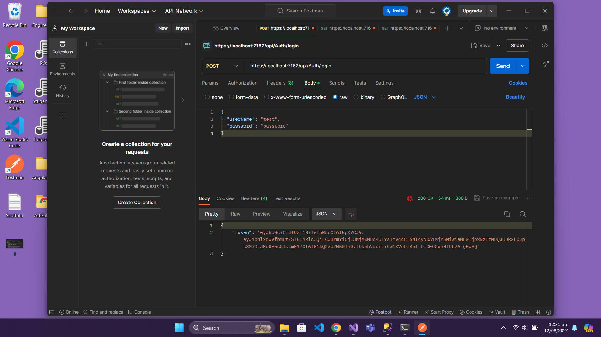

# .NET Backend API for Student and Course Management

## Overview

This project provides a .NET backend API for managing student and course operations, including CRUD (Create, Read, Update, Delete) functionalities. Additionally, it includes authentication features to secure access to the API. The API uses JWT (JSON Web Tokens) for user authentication and authorization.

## Features

- **Student and Course CRUD Operations:** Perform Create, Read, Update, and Delete operations on student and course data.
- **Authentication:** Secure endpoints with JWT tokens. Users can log in to receive a token, which is used to access protected resources.
- **Token-Based Authentication:** The `AuthController` provides a login endpoint that returns a JWT token upon successful authentication.

  
  

  

  

  
## API Endpoints

### Authentication

- **Login:**
  - **Endpoint:** `POST /api/auth/login`
  - **Description:** Authenticates a user and returns a JWT token.
  - **Request Body:**
    ```json
    {
      "UserName": "test",
      "Password": "password"
    }
    ```
  - **Response:**
    ```json
    {
      "Token": "your-jwt-token"
    }
    ```
  
### Testing

The API endpoints have been tested using Postman to ensure proper functionality. Test cases include successful and failed login attempts, token generation, and protected resource access.

 

## Project Setup

### Install SQL Server Packages:

   Add the necessary packages for SQL Server support:
   ```bash
   dotnet add package Microsoft.EntityFrameworkCore.SqlServer
   dotnet add package Microsoft.EntityFrameworkCore.Design
   ```
### Scaffold the Database Context:

   Scaffold your database context with the following command. Replace POS and localhost with your database name and host as needed:
     
     ```bash
       
      Scaffold-DbContext "Server=localhost; Database=POS; Trusted_Connection=true; TrustServerCertificate=True; Integrated Security=true; MultipleActiveResultSets=True;" Microsoft.EntityFrameworkCore.SqlServer -         OutputDir Database -Context POS_db_Context -NoOnConfiguring -Force
   

### Update Program.cs to Include the New Interface:

   ```bash   
   builder.Services.AddScoped<IAuthorizeService, AuthorizeService>();

   // Register other services and interfaces
   ```

### And you are good to go :)
